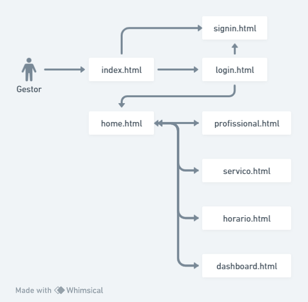

# Projeto Maia

## 1. Objetivo

O objetivo deste documento é definir as necessidades e características da aplicação na visão do administrador do Projeto Maia

## 2. Descrição do Sistema

O projeto consiste em aplicação web onde um administrador de um ambiente de prestação de serviços diversos pode utilizar para:

- Cadastrar sua empresa
- Cadastrar os serviços prestados
- Cadastrar os profissionais prestadores de serviço

Com esse cadastros básicos a aplicação deve fornecer para o administrador um calendário com as datas dos próximos dias.

Em cada dia o administrador pode incluir os serviços que são prestados ali. Dessa forma nasce o primeiro vínculo: Dia/Serviços disponíveis.

Em cada serviço daquele dia, podem ser cadastrados os horários de prestação daquele serviço. Serviço/Horário.

Para cada horário do serviço pode ser informado quais profissionais estarão disponíveis.

Esse conjunto de informações é suficiente para fornecer para os usuários interessados nos serviços poderem selecionar o serviço, dia, hora e profissional desejado. Dessa forma o cadastro de agendamentos será alimentado automaticamente.

O administrador poderá verificar os agendamentos do dia de maneira prévia.

Dessa maneira diversas funcionalidades podem ser derivadas, incluindo apuração dos serviço do dia por profissional.

## 3. Partes interessadas

### Gestor

|                |                               |
|----------------|-------------------------------|
| Descrição | Pessoa interessada em cadastrar sua empresa com os serviços disponibilizados por ela para serem agendados por usuários finais. |
| Papel | Manter os cadastros dentro do sistema |
| Insumos ao projeto | Requisitos |
| Representante | Christian Pompeu da Silva |

## 4. PERSONAS

### Gestor

|                |                          |
|----------------|-------------------------------|
| Descrição | Pessoa que utiliza o sistema para manter os cadastros e a integração |
| Papel | Utilizar o sistema web |
| Insumos ao projeto | Cadastra o Profissional. Cadastra Serviços. Cadastra Serviço/Profissional. Cadastra Horários. Vincula Horários aos Serviços. Cadastra Servico/Horario/Profissional |
| Representante | Christian Pompeu da Silva |

### Cliente

|                |                          |
|----------------|-------------------------------|
| Descrição | Pessoa interessada em consumir um determinado serviço |
| Papel | Acessar o sistema para agenda para a si um serviço prestado |
| Insumos ao projeto | Seleciona o serviço desejado. Seleciona o horário disponível. Seleciona o profissional disponível. Visualiza os últimos serviços consumidos |
| Representante | Christian Pompeu da Silva |

## 5. Necessidades e Funcionalidades

- #N001. Manter Profissional
    - #N001-F001. Inserir novo Profissional
    - #N001-F002. Listar profissionais
    - #N001-F003. Visualizar e editar os profissionais
    - #N001-F004. Excluir profissionais
- #N002. Manter os Serviços
    - #N002-F001. Inserir novo Serviço
    - #N002-F002. Listar Serviços
    - #N002-F003. Visualizar e editar serviços
    - #N002-F004. Excluir serviços cadastrados
- #N003. Manter vínculo Serviço/Profissional
    - #N003-F001. Vincular Serviço com profissional
    - #N002-F002. Excluir vínculo de serviço com profissional
- #N004. Manter Horários
    - #N004-F001. Inserir novo Horário
    - #N004-F002. Listar Horários
    - #N004-F003. Visualizar e editar Horários
    - #N004-F004. Excluir Horários
- #N005. Manter Horários/Serviços
    - #N005-F001. Vincular Horário com serviços
    - #N005-F002. Desvincular horários dos serviços
- #N006. Manter Serviço por horário e profissional
    - #N006-F001. Vincular Serviço com horário e profissional
    - #N006-F002. Desvincular Serviço com horário e profissional

## 6. Arquitetura
|                |                          |                          |
|----------------|-------------------------------|-------------------------------|
| Linguagem | Typescript | https://www.typescriptlang.org/ |
| Framework FrontEnd | React com Next JS | https://nextjs.org/ |
| Banco de Dados | MongoDB Atlas |  |
| ORM | Prisma | https://www.prisma.io/ |
| Deploy | Vercel | https://vercel.com/ |
| Framework de Estilização | Material UI |  |

## 7. Configuração Ambiente

- Visual Studio Code
    - Extensões:
        - Prisma CLI
        - Vercel CLI
        - Gluestack

## 8. Fluxo de telas

